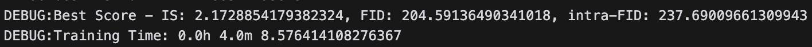

# 24-2 시각지능학습 Image Generation

## 1. Clone the repository

```shell
git clone https://github.com/hy-vision-learning/generation-submit
```

## 2. Move to generation-submit

```shell
cd ./generation-submit
```

## 3. Install Required Packages

All required packages can be installed via requirements.txt.
```shell
pip install -r requirements.txt
```

> [!NOTE]
> If an error related to package versions occurs during installation, remove the version information and try again.

## 4. Change the random seed

Open the [change_randomseed.py](./change_randomseed.py) file and change the random seed.

## 5. Generate Evaluation Data

Run the command below to generate data for performance evaluation.
```shell
python3 generate_inception_data.py
```

## 	6. Run the code

Run the command below to start training.
```shell
python3 main.py  --model BIGGAN --num_epochs 600 --save_every 1000 --test_every 500 --full_test_counter 10 --superclass 1 --dict_size 4 --commitment 10.0 --dict_decay 0.9
```

## 7. Check the Results

Check the best performance and training time in the log file located inside the save/biggan/[date] folder.


